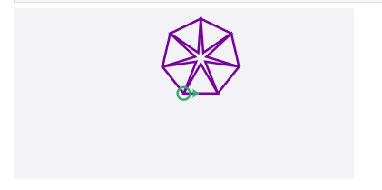
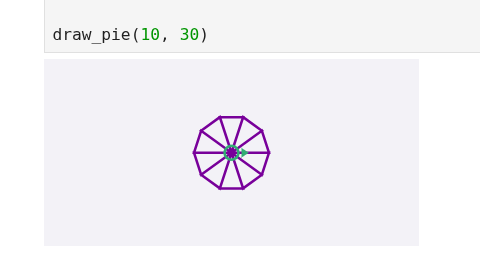

# Law of Sines Visualizer

## Overview
This project is a **computational geometry exercise** inspired by an advanced drawing problem from  
*Think Python (3rd Edition) — Allen B. Downey*.

The goal is to construct a **generalized geometric drawing method** that approximates a circle using
polygonal segments, derived purely from trigonometric relationships rather than hard-coded geometry.

---

## Problem Statement
The task is to design a function `draw_pie()` that can:

- draw a circle of **any radius**
- approximate the circle using **any number of sides (n)**
- rely only on a **single primitive drawing function** based on triangles

This forces the solution to be **fully parametric** and **mathematically grounded**.

---

## Geometric Insight
The circle is approximated by dividing it into **n identical isosceles triangles**, each subtending
an angle θ between adjacent sides.

Using the **Law of Sines**, the base length of each triangle segment is derived as:
base = (sin(fi) / sin(θ)) * radius

## Iterations & Corrections

During development, several incorrect geometric assumptions were tested
and visually analyzed before arriving at the final formulation.

These intermediate sketches helped identify:
- incorrect angle relationships
- scaling inconsistencies
- limitations of naive constructions

## Visual Reasoning & Results

The geometry was reasoned visually before implementation.
Below are sketches and generated outputs that validate the trigonometric model.

### Hand-drawn geometric reasoning

### Early geometric attempts (incorrect)

### Refined reasoning after correction

